<picture>
  <source media="(prefers-color-scheme: dark)" srcset="checks-dark.svg">
  
</picture>

## Kerem Özdemir

Sustainability and economics, read in parallel at the Technical University of
Munich and Istanbul University. Munich.

Everything here is published with its method and its limits. The numbers are
meant to be checked rather than believed.

**[keremozdemir.de](https://keremozdemir.de)** — the tools running in a
browser, the case studies behind them, and where every figure came from.

### Where the work is

| | |
|---|---|
| [esg-toolkit](https://github.com/Keremozdemirra/esg-toolkit) | Carbon decomposition, target pathways, abatement cost, CBAM embedded emissions |
| [analyst-toolkit](https://github.com/Keremozdemirra/analyst-toolkit) | Market sizing from two directions, and a discounted cash flow with the terminal value taken apart |
| [open-climate-data](https://github.com/Keremozdemirra/open-climate-data) | Public climate, energy and emissions datasets, every value carrying its source, version and date |
| [unitguard](https://github.com/Keremozdemirra/unitguard) | Unit and dimension safety for energy and emissions arithmetic. It refuses rather than guesses |
| [simea](https://github.com/Keremozdemirra/simea) | Research on agency in multi-agent systems, published as written findings |

Twelve further repositories hold the working method as skill packs, one per
trade. Python, MIT, and no dependency that has not earned its place.

The figure above is drawn from the tools themselves rather than typed in,
and every bar is a page you can open.
